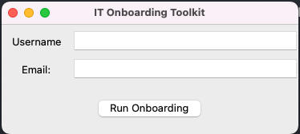

# 🛠️ IT Onboarding Automation Toolkit

This project simulates an automated onboarding workflow used by IT support teams to set up new hire environments. It includes user creation (simulated), folder setup, and welcome email generation — now enhanced with a simple GUI using Python's `tkinter` library.

---

## 📌 Features

- ✅ Simulated user account creation and logging
- 📁 Automated home folder structure setup
- ✉️ Welcome email draft generation
- 🖥️ Graphical interface for easy use (Tkinter)
- 📄 Modular scripts and CLI compatibility

---

## 🧰 Technologies Used

- Python 3.8+
- Tkinter (built-in GUI module)
- Standard Python libraries (`os`, `datetime`)

---

## 🚀 How to Run

### 📦 1. Clone the Repository

```bash
git clone https://github.com/yourusername/onboarding_toolkit.git
cd onboarding_toolkit
python3 gui_onboarding.py

```


